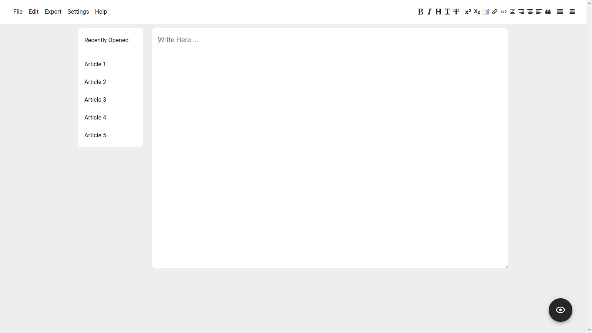

# Twinkles

A cross platform markdown text editor

## Features

- Simple
- Lightweight
- Export markdown to HTML, and PDF
- Offline code highlightining
- Ships with grammary

## Demo

## Installation

visit [https://twinkles.vercel.app](https://twinkles.vercel.app)

## License

[MIT](https://choosealicense.com/licenses/mit/)

## Feedback

If you have any feedback, please reach out to us at fake@fake.com

## 🚀 About Me

**Hi, I'm Opeoluwa! 👋**

A full stack developer devoted to building community projects...

If you find Twinkles helpful, consider [buying me pizza 🍕](https://getfidia.com/pay/opeolluwa/open-source)
